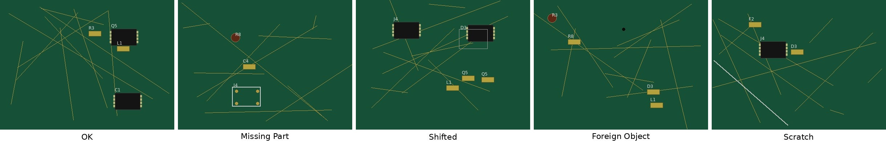

# 工业元件缺陷数据标注（个人实践项目）

> 使用 **Label Studio** 独立完成的一套工业 PCB 元件缺陷标注数据集，覆盖**图像分类 + 目标检测 + OCR** 三重任务，并产出了可复用的**标注规范 SOP** 与**质量验收报告**。
>

---

## 一、项目概览

| 项目 | 内容 |
|---|---|
| 标注工具 | Label Studio（开源，工业界主流） |
| 任务类型 | 图像分类（5 类）、目标检测（检测框）、OCR（丝印识别） |
| 数据规模 | 30 张工业元件图（合成图，5 类 × 6 张） |
| 缺陷类别 | `OK` / `缺件` / `偏移` / `异物` / `划痕` |
| 核心产出 | 标注数据集 + 标注规范 SOP + 质量验收报告 |
| 首轮分类准确率 | **90.0%（27/30）**，0 漏标 |

---

## 二、五类缺陷对照



判断口诀：**「先看有没有元件。有但歪 = 偏移；连元件都没有 = 缺件。」**
完整判定标准见 [`docs/缺陷判断标准说明.md`](docs/缺陷判断标准说明.md)。

---

## 三、目录结构

```
industrial-defect-annotation/
├── README.md                      # 本文件
├── label_studio_config.xml        # Label Studio 标注模板（直接导入可用）
├── data/
│   ├── *.jpg                      # 30 张练习图（01_OK ~ 30_划痕）
│   ├── labels.csv                 # 参考真值（用于自测一致性）
│   └── annotations_export.json    # 本人标注导出结果（project-1）
├── docs/
│   ├── SOP_缺陷判定规范.md         # 决策树 + 检测框/OCR 规范 + 验收标准
│   └── 缺陷判断标准说明.md         # 每类缺陷详细判断标准
└── assets/
    └── 五类缺陷对照图.jpg
```

---

## 四、快速复现

1. 本地启动 Label Studio：
   ```bash
   pip install label-studio
   label-studio
   ```
2. 新建项目 → `Settings` → `Labeling Interface` → `Code` 模式，粘贴 [`label_studio_config.xml`](label_studio_config.xml) 内容并保存。
3. 在 `Data Manager` 中批量上传 `data/` 下的 30 张图片。
4. 逐张完成：① 选缺陷分类 ② 框选元件/焊点 ③ 填写丝印 OCR 文字。
5. `Export` → 选择 JSON 格式，即可导出类似 `data/annotations_export.json` 的结果。

---

## 五、标注规范 SOP（摘录）

**分类判定决策树：**
```
第1步：该装元件的位置，元件在吗？
  └ 不在（只有空焊盘）→ 缺件
  └ 在 → 第2步
第2步：元件对准焊盘了吗？
  └ 明显偏离/悬空 → 偏移
  └ 对齐 → 第3步
第3步：板面有不该有的黑点吗？
  └ 有 → 异物
  └ 没有 → 第4步
第4步：板面有划伤灰白线吗？
  └ 有 → 划痕
  └ 没有 → OK
```

完整规范（检测框 / OCR / 验收标准）见 [`docs/SOP_缺陷判定规范.md`](docs/SOP_缺陷判定规范.md)。

---

## 六、质量验收结果

| 指标 | 结果 | 评价 |
|---|---|---|
| 分类准确率 | **27/30 = 90.0%** | 首次标注即达标 |
| 漏标分类 | 0 张 | 全部完成 |
| 检测框覆盖 | 30/30 张，平均 3.6 框/张 | 完整 |
| OCR 填写 | 30/30 张均已填写 | 完整 |

**3 个错误全部集中在「缺件 ↔ 偏移」**，这正是真实工业质检中最易混淆的一对：
- `偏移` = 元件**在，但没对准**；
- `缺件` = 元件**根本不在，只剩焊盘**。

> 这一发现被沉淀为 SOP 里的强制复核项：**易混缺陷（缺件 vs 偏移）必须二次复核**。

---

## 七、项目价值

- **工具**：熟练使用 Label Studio 完成分类 / 检测 / OCR 全流程标注；
- **方法**：能独立制定缺陷判定规范（决策树 + 验收标准）；
- **质量意识**：会用真值核对、定位易混难点、输出可改进结论；
- **闭环能力**：数据采集 → 标注 → 验收 → 规范沉淀，完整跑通。


本数据集为合成练习图，仅供学习展示。
